<div align="center">

# Selective ECG Classification Under Signal Degradation

### Evaluating whether auxiliary reliability signals improve selective error ranking beyond model confidence

<br/>

[](https://physionet.org/content/ptb-xl/1.0.3/)
[](https://physionet.org/content/ptb-xl/1.0.3/)
[](#chapman-shaoxing-independent-replication)
[](#evaluation-metric-aurc)
[](#statistical-evaluation)
[](https://www.python.org/)

<br/>

**A reproducible two-dataset study of selective ECG prediction under controlled signal degradation.**

The central question is simple:

> **When an ECG classifier is uncertain or the signal is degraded, can auxiliary reliability information identify prediction errors better than the classifier's own output confidence?**

</div>

---

## Overview

Modern ECG classifiers can achieve high predictive performance, but a clinically relevant system also needs to know **which predictions should not be trusted**.

Selective prediction addresses this problem by ranking ECGs according to reliability and allowing the system to defer the least reliable cases for further review.

This project evaluates four possible reliability signals:

| Symbol | Reliability signal | Interpretation |
|:---:|---|---|
| **C** | Output confidence | How strongly the classifier supports its prediction |
| **L** | Annotation support | Strength of diagnostic annotation evidence available in PTB-XL |
| **Q** | Waveform quality | Signal-quality evidence derived directly from the ECG waveform |
| **U** | Model uncertainty | Predictive disagreement estimated using MC dropout |

The study first evaluates these signals on **PTB-XL** and then performs an **independent methodological replication on Chapman-Shaoxing**.

The experiments include both clean ECGs and controlled signal degradation.

---

## Key Finding

<div align="center">

### Output confidence remained the strongest selective error-ranking signal in both datasets.

</div>

For **PTB-XL**, output confidence had the lower AURC point estimate in all **39 prespecified comparisons**, with **38 of 39 paired-bootstrap 95% intervals entirely favoring confidence**.

For the independent **Chapman-Shaoxing replication**, output confidence again outperformed the tested auxiliary alternatives:

| Chapman result | Outcome |
|---|---:|
| Prespecified comparisons | **26** |
| Point estimates favoring confidence | **26 / 26** |
| 95% bootstrap intervals entirely favoring confidence | **26 / 26** |
| Intervals containing zero | **0 / 26** |

The result supports an important distinction:

> **A reliability signal can respond strongly to signal degradation without necessarily becoming better at ranking which individual predictions are wrong.**

---

# Study Workflow

```mermaid
flowchart LR

    A["12-lead ECG"] --> B["Frozen Train / Validation / Test Split"]
    B --> C["ResNet1D Classifier"]
    C --> D["Frozen Validation Thresholds"]

    D --> E["Reliability Signals<br/>C · L · Q · U"]
    E --> F["Clean ECG"]
    E --> G["12 Controlled Corruptions"]

    F --> H["Selective Ranking"]
    G --> H

    H --> I["Risk-Coverage Curves"]
    I --> J["AURC"]
    J --> K["Paired Bootstrap Inference"]

    style A fill:#D6EAF8,stroke:#2471A3,stroke-width:2px
    style B fill:#E8DAEF,stroke:#7D3C98,stroke-width:2px
    style C fill:#D5F5E3,stroke:#239B56,stroke-width:2px
    style D fill:#D5F5E3,stroke:#239B56,stroke-width:2px
    style E fill:#FCF3CF,stroke:#B7950B,stroke-width:2px
    style F fill:#FDEBD0,stroke:#CA6F1E,stroke-width:2px
    style G fill:#FADBD8,stroke:#C0392B,stroke-width:2px
    style H fill:#D6EAF8,stroke:#2471A3,stroke-width:2px
    style I fill:#D6EAF8,stroke:#2471A3,stroke-width:2px
    style J fill:#E8DAEF,stroke:#7D3C98,stroke-width:2px
    style K fill:#D5F5E3,stroke:#239B56,stroke-width:2px
```



---

# Research Question

The study asks:

> **Do auxiliary reliability signals provide better selective error ranking than ordinary model output confidence when ECG signals are clean or degraded?**

This question is different from simply asking whether uncertainty or signal-quality scores increase when the waveform becomes corrupted.

For selective prediction, a useful score must rank **actual prediction errors** ahead of correct predictions.

---

# Study at a Glance

| Component | PTB-XL | Chapman-Shaoxing |
|---|---:|---:|
| ECG recordings | **21,388** | **10,646** |
| Training | 17,084 | 8,516 |
| Validation | 2,146 | 1,065 |
| Final test | 2,158 | 1,065 |
| Input leads | 12 | 12 |
| Final sampling rate | 100 Hz | 100 Hz |
| Output labels | 5 | 5 |
| Architecture | ResNet1DWang | ResNet1DWang |
| Trainable parameters | 473,349 | 473,349 |
| Reliability signals | C, L, Q, U | C, Q, U |
| Corruption families | 4 | 4 |
| Corruption conditions | 12 | 12 |
| MC-dropout passes | 30 | 30 |
| Main metric | AURC | AURC |
| Bootstrap replicates | 5,000 | 5,000 |

---

# Dataset 1 — PTB-XL

The primary study uses **PTB-XL v1.0.3**.

A total of **21,388 usable ECG recordings** were retained for the five-superclass multilabel classification task.

### Diagnostic targets

The model predicts:

- **NORM** — normal ECG
- **MI** — myocardial infarction
- **STTC** — ST/T change
- **CD** — conduction disturbance
- **HYP** — hypertrophy

### Patient-disjoint split

The recommended PTB-XL folds were preserved:

| Split | Fold(s) | ECGs |
|---|---:|---:|
| Training | 1–8 | **17,084** |
| Validation | 9 | **2,146** |
| Final test | 10 | **2,158** |
| **Total** | 1–10 | **21,388** |

The final test set contains **1,877 unique patients**.

> **Leakage protection:** normalization parameters were estimated from training data only. Decision thresholds and reliability-reference quantities were selected using validation data and frozen before final test evaluation.

---

# Dataset 2 — Chapman-Shaoxing Independent Replication

To test whether the main conclusion was specific to PTB-XL, the methodology was independently replicated on the **Chapman-Shaoxing ECG dataset**.

The replication uses **10,646 12-lead ECG recordings**.

The original recordings contain **5,000 samples per lead at 500 Hz**. They were converted to the same model input resolution used in the primary study:

```text
500 Hz / 5000 samples
        ↓
anti-aliased resampling
        ↓
100 Hz / 1000 samples
        ↓
12 × 1000 model input
```

Resampling was performed with:

```python
scipy.signal.resample_poly(up=1, down=5)
```

Normalization was again estimated from the **training partition only**.

### Chapman targets

Five binary targets were used:

| Target | Test positives |
|---|---:|
| SB | 390 |
| AFIB | 178 |
| ST | 156 |
| TWC | 191 |
| LVHV | 132 |

The frozen split was:

| Split | ECGs |
|---|---:|
| Training | **8,516** |
| Validation | **1,065** |
| Final test | **1,065** |
| **Total** | **10,646** |

The frozen cohort manifest is included in:

```text
results/external_validation/chapman/v1/chapman_frozen_cohort.csv
```

> **Important:** Chapman-Shaoxing is an **independent methodological replication**, not label-identical external validation of the PTB-XL classifier. A separate model was trained because the target definitions differ between datasets.

---

# ECG Classification Model

Both studies use the same **ResNet1DWang** architecture for 12-lead time-series classification.

| Training component | Setting |
|---|---|
| Architecture | ResNet1DWang |
| Trainable parameters | **473,349** |
| Input | `12 × 1000` |
| Outputs | 5 logits |
| Loss | Binary cross-entropy with logits |
| Optimizer | AdamW |
| Learning-rate schedule | One-Cycle |
| Training epochs | 50 |
| Primary seed | `20260826` |
| Checkpoint selection | Validation macro-AUROC |

For PTB-XL, additional seeds were evaluated to assess validation stability:

```text
20260826
20260827
20260828
```

For final testing, all development decisions were frozen before evaluation of the held-out test partition.

---

# Reliability Signals

## C — Output Confidence

For each binary output, confidence reflects the probability assigned to the predicted state.

ECG-level confidence is obtained by averaging across the five output labels.

This is the simplest reliability baseline and requires **no auxiliary model or metadata**.

---

## L — Annotation Support

PTB-XL provides diagnostic likelihood information associated with clinical annotations.

These likelihood values are converted into an ECG-level annotation-support signal.

`L` is therefore available in the **PTB-XL analysis only**.

Chapman-Shaoxing does not provide an equivalent likelihood field, so `L` is not artificially reconstructed for the replication study.

---

## Q — Waveform Quality

Waveform quality is estimated directly from the ECG using four signal-level badness components:

- baseline burden
- high-frequency burden
- lead-dropout burden
- clipping burden

Each component is referenced to the clean training distribution.

The final quality score is oriented so that:

```text
higher Q = better waveform quality
```

---

## U — Model Uncertainty

Model uncertainty is estimated using **Monte Carlo dropout**.

For each ECG:

```text
30 stochastic forward passes
        ↓
predictive distributions
        ↓
mean mutual information
        ↓
uncertainty score U
```

Larger `U` indicates greater disagreement across stochastic predictions.

---

# Reliability Combinations

Auxiliary reliability scores are also combined after empirical percentile normalization.

For PTB-XL, combinations include:

```text
L + Q
L + U
Q + U
L + Q + U
```

For Chapman-Shaoxing, where annotation likelihood is unavailable:

```text
Q + U
```

Output confidence is intentionally retained as a **standalone comparator** rather than inserted into the auxiliary combinations.

---

# Controlled Signal Degradation

Each held-out test ECG is evaluated in its clean form and under **12 controlled corruption conditions**.

Four corruption families are used:

| Corruption family | Purpose |
|---|---|
| Baseline wander | Simulates low-frequency baseline movement |
| Additive white noise | Introduces broadband measurement noise |
| Amplitude clipping | Removes extreme waveform amplitudes |
| Lead masking | Simulates missing or unavailable ECG leads |

Each family contains:

```text
Mild
Moderate
Severe
```

Therefore every test set is evaluated under:

```text
1 clean condition
+
12 corruption conditions
=
13 total evaluation conditions
```

The same corruption framework is reused in the Chapman replication.

---

# Evaluation Metric — AURC

The primary metric is the **Area Under the Risk-Coverage Curve (AURC)**.

> **AURC is not AUROC.**

AUROC measures discrimination between positive and negative class labels.

AURC instead evaluates **selective prediction**.

The procedure is:

```text
Assign each ECG a reliability score
                ↓
Rank ECGs from most to least reliable
                ↓
Retain increasingly larger fractions of the dataset
                ↓
Measure prediction error at each coverage level
                ↓
Construct the risk-coverage curve
                ↓
Integrate the curve → AURC
```

Risk is defined using the mean **five-label Hamming error** among retained ECGs.

### Interpretation

<div align="center">

**Lower AURC = better selective error ranking**

</div>

A strong reliability signal removes error-prone ECGs earlier and therefore maintains lower prediction risk as coverage increases.

---

# PTB-XL Results

The primary PTB-XL experiment showed that **output confidence remained difficult to improve upon**.

On clean test data:

| Selector | AURC ↓ |
|---|---:|
| **Confidence (C)** | **0.0552** |
| L + U | 0.0604 |
| U | 0.0647 |
| L + Q + U | 0.0791 |
| Q + U | 0.0909 |
| L | 0.1013 |
| L + Q | 0.1178 |
| Q | 0.1321 |

Across the full clean-plus-corruption evaluation:

```text
39 prespecified comparisons
39 / 39 point estimates favored confidence
38 / 39 paired-bootstrap intervals were entirely above zero
```

The one remaining interval contained zero rather than showing evidence that the auxiliary alternative was superior.

---

# Chapman-Shaoxing Results

## Classification Performance

The independently trained Chapman model achieved strong held-out clean-test performance:

| Metric | Result |
|---|---:|
| Macro-AUROC | **0.9741** |
| Macro average precision | **0.8845** |
| Macro-F1 | **0.8411** |
| Five-label Hamming risk | **0.0588** |

---

## Clean Selective-Prediction Performance

| Reliability selector | Clean AURC ↓ |
|---|---:|
| **Confidence** | **0.0171** |
| U | 0.0203 |
| Q + U | 0.0301 |
| Q | 0.0643 |

The same ordering observed in the primary experiment therefore appeared in the independent dataset.

---

## Performance Under Severe Corruption

| Condition | Confidence ↓ | U ↓ | Q + U ↓ |
|---|---:|---:|---:|
| Severe baseline wander | **0.0191** | 0.0225 | 0.0329 |
| Severe white noise | **0.0915** | 0.0974 | 0.1026 |
| Severe amplitude clipping | **0.0277** | 0.0319 | 0.0353 |
| Severe lead masking | **0.0608** | 0.0710 | 0.0765 |

Across every one of the **13 clean/corrupted conditions**, confidence had lower AURC than both primary auxiliary comparators.

---

# Statistical Evaluation

Statistical uncertainty is evaluated using **5,000 paired bootstrap replicates**.

The paired design ensures that competing reliability strategies are compared on the same resampled ECGs.

The reported contrast is:

```text
ΔAURC = AURC(alternative) − AURC(confidence)
```

Therefore:

```text
ΔAURC > 0
```

means confidence has the lower AURC and therefore the better selective ranking.

---

## Chapman Bootstrap Results

Two comparisons were frozen before test analysis:

```text
U vs Confidence
Q + U vs Confidence
```

Across 13 evaluation conditions:

```text
2 comparisons × 13 conditions = 26 contrasts
```

Final result:

| Bootstrap outcome | Count |
|---|---:|
| Point estimates favoring confidence | **26 / 26** |
| 95% CIs entirely above zero | **26 / 26** |
| 95% CIs containing zero | **0 / 26** |
| 95% CIs entirely below zero | **0 / 26** |

For the clean test condition:

| Comparison | ΔAURC | 95% CI |
|---|---:|---:|
| U − Confidence | **0.0032** | **[0.0016, 0.0048]** |
| Q+U − Confidence | **0.0129** | **[0.0097, 0.0165]** |

Under severe lead masking:

| Comparison | ΔAURC | 95% CI |
|---|---:|---:|
| U − Confidence | **0.0103** | **[0.0066, 0.0143]** |
| Q+U − Confidence | **0.0158** | **[0.0116, 0.0202]** |

---

# What the Results Mean

The results do **not** imply that waveform quality or uncertainty are useless.

In fact, uncertainty and quality signals clearly respond to signal degradation.

The important result is narrower:

> **Responding to degradation is not the same as ranking prediction errors better.**

A reliability measure may successfully indicate:

```text
"This ECG looks unusual or degraded."
```

without being the best signal for:

```text
"This particular model prediction is likely to be wrong."
```

Across both experiments, model output confidence remained the strongest tested signal for the second task.

---

# Reproducibility Safeguards

Several safeguards are used to reduce leakage and post-test tuning:

| Stage | Safeguard |
|---|---|
| Normalization | Training data only |
| Model selection | Validation data only |
| Decision thresholds | Validation data only |
| Q reference | Training data only |
| Combination scaling | Clean validation data |
| Final test | Held out until development was frozen |
| Corruption protocol | Fixed before final comparisons |
| MC-dropout | 30 fixed passes |
| Statistical inference | 5,000 paired bootstrap replicates |

For the Chapman replication, the frozen protocol explicitly prohibits post-test changes to:

```text
thresholds
labels
normalization
Q definition
uncertainty definition
combination weights
corruption severities
```

---

# Repository Structure

```text
selective-ecg-signal-degradation/
│
├── configs/
│   └── corruption and experiment configuration
│
├── src/
│   └── ptbxl_reliability/
│       ├── model.py
│       ├── corruptions.py
│       ├── selective_prediction.py
│       ├── uncertainty.py
│       ├── waveform_signal_quality.py
│       └── supporting pipeline modules
│
├── scripts/
│   ├── PTB-XL experiment scripts
│   │
│   └── chapman/
│       ├── build_cache.py
│       ├── train_chapman.py
│       ├── freeze_reliability_references.py
│       ├── run_chapman_final_test.py
│       └── run_chapman_bootstrap.py
│
├── results/
│   ├── PTB-XL results
│   │
│   └── external_validation/
│       └── chapman/
│           └── v1/
│               ├── chapman_frozen_cohort.csv
│               ├── chapman_frozen_cohort_metadata.json
│               ├── chapman_normalization.json
│               ├── chapman_test_protocol.json
│               ├── chapman_validation_reliability_summary.json
│               ├── model_seed_20260826/
│               ├── final_test/
│               └── bootstrap/
│
├── tests/
├── figures/
├── pyproject.toml
└── README.md
```

---

# Reproducing the Chapman Experiment

The repository intentionally does **not** contain the raw multi-gigabyte ECG dataset.

After obtaining the Chapman-Shaoxing ECG CSV files, make them available at:

```text
data/raw/chapman/
```

The frozen cohort manifest and all lightweight experiment metadata are already included in the repository.

Run the pipeline in this order:

```bash
python scripts/chapman/build_cache.py

python scripts/chapman/train_chapman.py

python scripts/chapman/freeze_reliability_references.py

python scripts/chapman/run_chapman_final_test.py

python scripts/chapman/run_chapman_bootstrap.py
```

The stages correspond to:

```text
Raw ECGs
   ↓
validated 100-Hz cache
   ↓
train classifier
   ↓
freeze validation reliability references
   ↓
held-out clean + corruption evaluation
   ↓
paired bootstrap inference
```

---

# Chapman Reproducibility Artifacts

The repository contains the important lightweight artifacts required to inspect the experiment.

### Frozen study definition

```text
results/external_validation/chapman/v1/
├── chapman_frozen_cohort.csv
├── chapman_frozen_cohort_metadata.json
├── chapman_normalization.json
├── chapman_test_protocol.json
└── chapman_validation_reliability_summary.json
```

### Model outputs

```text
model_seed_20260826/
├── best_checkpoint.pt
├── validation_summary.json
└── validation_thresholds.json
```

### Final test results

```text
final_test/
├── condition_metrics.csv
└── summary.json
```

### Bootstrap results

```text
bootstrap/
├── primary_aurc_bootstrap_summary.csv
└── summary.json
```

Large raw datasets, waveform caches, per-condition intermediate arrays, and complete bootstrap replicate arrays are intentionally excluded from Git.

They can be regenerated using the supplied scripts.

---

# Why the Second Dataset Matters

The Chapman experiment changes several aspects of the problem simultaneously:

```text
different ECG collection
different label definitions
separately trained classifier
different raw sampling rate
independent train/validation/test split
```

Yet the central selective-prediction result remains consistent.

This makes the conclusion less dependent on the specific label structure or data partition of PTB-XL.

At the same time, it is important not to overstate what this means:

> The Chapman experiment is an **independent replication of the methodology**, not direct external validation of the PTB-XL classifier.

---

# Main Takeaway

<div align="center">

### Signal degradation awareness ≠ error-ranking superiority

</div>

Waveform quality and model uncertainty contain meaningful information about degraded ECGs.

However, across both datasets and the tested corruption settings, those signals did not outperform the classifier's own output confidence for the specific task of **selectively ranking prediction errors**.

This suggests a practical principle for reliability-aware machine learning:

> **Before introducing more complex auxiliary reliability mechanisms, compare them against a strong and carefully evaluated output-confidence baseline.**

---

# Limitations

This study should be interpreted within its experimental scope.

- The same primary neural architecture is used across the two datasets.
- The Chapman replication uses a different five-label task and therefore does not constitute direct external validation of the PTB-XL classifier.
- Annotation support `L` is unavailable for Chapman-Shaoxing and is therefore not included in the replication.
- Controlled corruption cannot represent every type of acquisition artifact or distribution shift encountered in clinical practice.
- Selective-prediction performance does not by itself establish clinical safety or clinical utility.
- Results concern the tested reliability definitions, architecture, datasets, and corruption protocol and should not be interpreted as a universal claim that uncertainty or signal-quality information can never improve selective prediction.

---

# Experimental Status


```text
PTB-XL experiments                 ✓ Complete
PTB-XL corruption evaluation       ✓ Complete
PTB-XL bootstrap inference         ✓ Complete

Chapman data preparation           ✓ Complete
Chapman model training             ✓ Complete
Chapman validation freezing        ✓ Complete
Chapman clean test                 ✓ Complete
Chapman corruption evaluation      ✓ Complete
Chapman bootstrap inference        ✓ Complete
```

---

<div align="center">

### Selective ECG Classification Under Signal Degradation

**PTB-XL primary study · Chapman-Shaoxing independent replication · Clean and corrupted ECGs · Selective prediction · AURC · Paired bootstrap inference**

</div>
